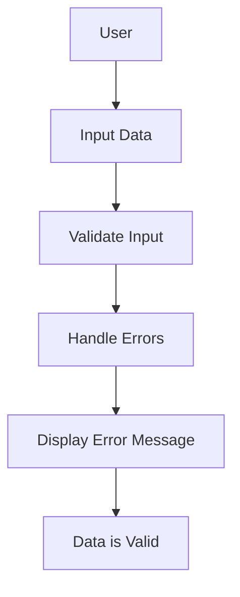

# 📁 Shared Input Component

## Tags
- **React**
- **Input Handling**
- **Form Validation**
- **Error Handling**
- **Custom Hooks**
- **Tailwind CSS**

## Language
- **JavaScript**
- **React.js**
- **CSS (Tailwind CSS)**

This project is a **React-based** shared input component that provides a user-friendly interface for handling various input types, including text, number, and email fields. The component features validation and error handling to enhance user experience.

## ✨ Features

- **Custom Input Types**: Supports multiple input types (text, number, email).
- **Validation**: Implements validation rules to ensure correct data entry.
- **Error Handling**: Displays error messages to guide users in correcting their input.
- **Reusable Component**: Can be easily integrated into any React application.
- **Custom Hooks**: Utilizes custom hooks for managing input state and validation.
- **Styling**: Leverages Tailwind CSS for a polished and responsive design.

## 🚀 Technologies Used

- **React**: Component-based library for building user interfaces.
- **Tailwind CSS**: Utility-first CSS framework for styling components.

## 🛠️ Project Setup

### 1. Clone the repository

```bash
git clone https://github.com/yourusername/shared-input-component.git
cd shared-input-component
```

### 2. Install dependencies

```bash
npm install
```

### 3. Run the application

```bash
npm start
```

The app will run locally at `http://localhost:3000`.

---

## 📸 Demo UI

### Here are some screenshots of the application in action:

**1. Input Field Interface:**


**2. Error Handling Example:**


**3. Validation Feedback:**


---

## ⚙️ Component Overview

### 1. **SharedInput Component**
Main component that handles the various input types and validation.

#### Approach:
- Input fields can be rendered based on the provided type prop.
- Validation rules are applied to ensure data integrity.
- Error messages are displayed if validation fails.

```js
const SharedInput = ({ type, value, onChange, validate }) => {
    const [error, setError] = useState('');

    const handleChange = (e) => {
        const { value } = e.target;
        onChange(value);
        
        if (validate) {
            const validationError = validate(value);
            setError(validationError);
        }
    };

    return (
        <div className="mb-4">
            <input
                type={type}
                value={value}
                onChange={handleChange}
                className={`border rounded p-2 ${error ? 'border-red-500' : 'border-gray-300'}`}
            />
            {error && <p className="text-red-500 text-sm">{error}</p>}
        </div>
    );
};
```

---

## 📊 Application Flow



1. User inputs data into the field.
2. The input is validated based on provided rules.
3. If validation fails, an error message is displayed.
4. If the data is valid, it can be processed further.

---

## 📐 Design and UI

The interface is designed using **Tailwind CSS** to provide a clean and responsive layout with a minimalistic design.

### Layout Preview:

```
+----------------------------------------------------+
|                Input Your Information              |
|                                                    |
|  [Input Field: Type text here]                    |
|                                                    |
|  [Error Message: This field is required.]         |
|                                                    |
+----------------------------------------------------+
```

---

## 🧩 Future Improvements

- **Additional Input Types**: Support for more input types (e.g., date, phone).
- **Custom Styling Options**: Allow for customizable styles via props.
- **Enhanced Accessibility**: Improve ARIA support for better accessibility.

---

## 📄 License

This project is open-source and available under the [MIT License](LICENSE).

---

## 💻 Contributing

Pull requests are welcome! For major changes, please open an issue first to discuss what you would like to change.

Feel free to contribute to the project or report any bugs.

---

## 🙌 Acknowledgments

- **React** for its component-based architecture.
- **Tailwind CSS** for utility-first styling.
