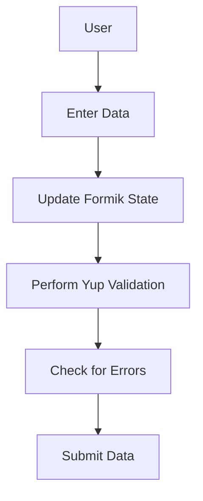

Here's the `README.md` file for your project using the requested format:

---

# 📁 Form Validation Application

## Tags
- **React**
- **Formik**
- **Yup**
- **Form Handling**
- **Validation**
- **Custom Components**
- **Modern UI**
- **Tailwind CSS**

## Language
- **JavaScript**
- **React.js**
- **CSS (Tailwind CSS)**

This project is a **React-based Form Validation Application** that provides a user-friendly interface for managing input fields and validations. It features reusable input components, form validation, and error handling with a modern UI built using Tailwind CSS.

## ✨ Features

- **Reusable Input Components**: A flexible set of input fields including text, email, password, checkboxes, and more.
- **Formik Integration**: Form handling with **Formik** for easy form state management.
- **Validation with Yup**: Form validation using **Yup** schema definitions for robust data handling.
- **Error Handling**: Provides real-time feedback with clear error messages for each input field.
- **Modern UI**: A sleek and responsive user interface powered by Tailwind CSS with smooth transitions and modern styling.
- **Custom Input Grouping**: Easily manage groups of inputs such as checkboxes and radio buttons with a shared component approach.

## 🚀 Technologies Used

- **React**: A component-based library for building the user interface.
- **Formik**: For form state management and submission handling.
- **Yup**: A validation schema builder for ensuring data integrity.
- **Tailwind CSS**: A utility-first CSS framework for styling components.

## 🛠️ Project Setup

### 1. Clone the repository

```bash
git clone https://github.com/jainil524/BrainyBeam.git
cd task4/FormValidationWithFormik
```

### 2. Install dependencies

```bash
npm install
```

### 3. Run the application

```bash
npm run dev
```

The app will run locally at `http://localhost:5173`.

---

## 📸 Demo UI

### Here are some screenshots of the application in action:

**1. Modern Input Fields:**


**2. Error Handling Example:**


**3. Final Submission:**


---

## ⚙️ Component Overview

### 1. **Shared Input Component**
The primary component for rendering input fields. Supports multiple types and includes validation.

#### Approach:
- Handles text, email, password, checkboxes, radio buttons, and more.
- Error messages are displayed dynamically based on the Yup validation schema.
- Inputs are rendered based on props, making the component reusable across various forms.
---

## 📊 Application Flow



1. User enters data in the input fields.
2. The form state is managed by Formik.
3. Yup validates the data based on predefined rules.
4. Errors are displayed if any field is invalid; otherwise, the form is submitted.

---

## 📐 Design and UI

The UI is built with **Tailwind CSS** for responsiveness and flexibility, featuring modern form controls with hover effects and animations.

### Layout Preview:

```
+--------------------------------------------------+
|            Please Fill the Form Below            |
|                                                  |
|  [Name: _________]                               |
|                                                  |
|  [Email: _________]                              |
|                                                  |
|  [Password: _________]                           |
|                                                  |
|  [I agree to the terms] [✓]                      |
|                                                  |
|  [Submit]                                        |
+--------------------------------------------------+
```

---

## 🧩 Future Improvements

- **Additional Input Types**: Implement more complex inputs like date pickers and file uploads.
- **Custom Themes**: Allow for theme switching between light and dark modes.
- **Advanced Error Handling**: Implement tooltip-based error handling for a better user experience.

---

## 📄 License

This project is open-source and available under the [MIT License](LICENSE).

---

## 💻 Contributing

Pull requests are welcome! For major changes, please open an issue first to discuss the proposed changes.

---

## 🙌 Acknowledgments

- **Formik** for simplifying form state management.
- **Yup** for easy-to-use validation.
- **Tailwind CSS** for its powerful utility-based styling.

