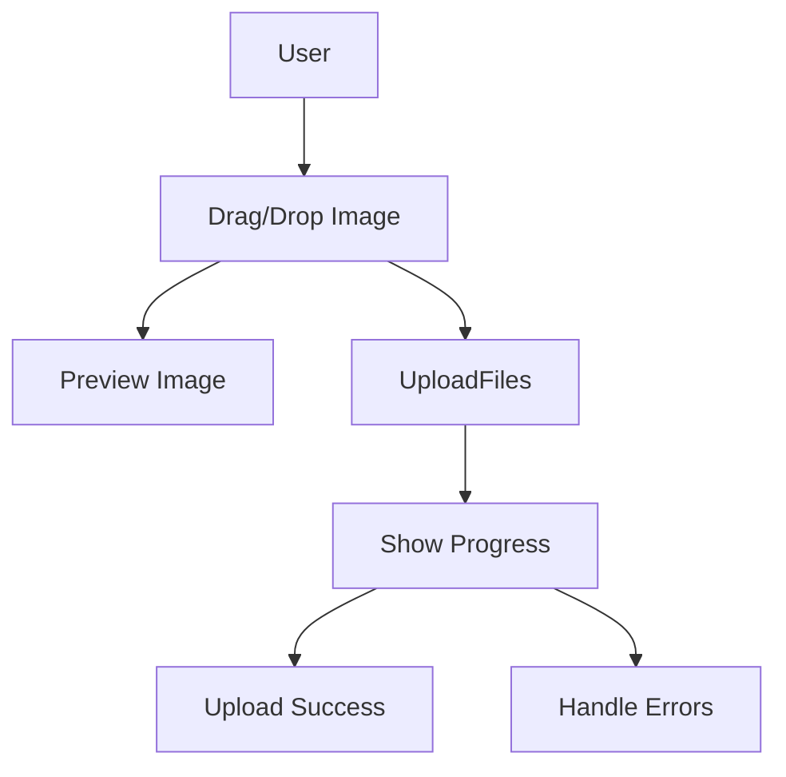

Here’s an updated version of your README file with a section for demo UI images added. You can include images of the application interface in the provided space.

---

# 📁 Image Upload with Progress & Alert System

## Tags
- **React**
- **Image Upload**
- **File Preview**
- **Progress Bar**
- **Alerts**
- **Drag and Drop**
- **Simulated File Upload**
- **Tailwind CSS**
- **React Dropzone**

## Language
- **JavaScript**
- **React.js**
- **CSS (Tailwind CSS)**

This project is a **React-based** image upload application that provides a user-friendly interface for dragging and dropping multiple images, tracking upload progress, and showing notifications for successful or failed uploads. The project also handles file size formatting and supports previewing images before uploading them.

## ✨ Features

- **Drag-and-Drop Upload**: Supports dragging images into the dropzone or selecting files manually.
- **File Preview**: Displays thumbnails of the images before uploading.
- **Progress Bar**: Tracks the upload progress of each file.
- **Alerts**: Displays error or success messages during the upload process.
- **File Size Formatting**: Dynamically formats and displays file size (in Bytes, KB, MB, etc.).
- **File Removal**: Allows users to remove files from the upload list before or after upload.
- **Simulated Upload Process**: Uses a simulated upload function to mock the file upload process.

## 🚀 Technologies Used

- **React**: Component-based library for building the user interface.
- **React Dropzone**: Handles drag-and-drop functionality.
- **Lucide Icons**: Used for icons (upload, delete, success, and error).
- **Tailwind CSS**: Used for styling the components and layout.

## 🛠️ Project Setup

### 1. Clone the repository

```bash
git clone https://github.com/yourusername/image-upload-progress-alert.git
cd image-upload-progress-alert
```

### 2. Install dependencies

```bash
npm install
```

### 3. Run the application

```bash
npm start
```

The app will run locally at `http://localhost:3000`.

---

## 📸 Demo UI

### Here are some screenshots of the application in action:

**1. Drag and Drop Interface:**


**2. File Preview:**


**3. Progress Bar Example:**


**4. Success Alert:**


---

## ⚙️ Component Overview

### 1. **Alert Component**
Displays notifications based on the type of error or success message. This is designed to inform users about upload status.

```js
const Alert = React.forwardRef(({ className, variant, ...props }, ref) => {
    return (
        <div
            ref={ref}
            role="alert"
            className={`rounded-lg border p-4 ${variant === 'destructive'
                ? 'border-red-500 bg-red-50 text-red-700'
                : 'border-gray-200 bg-white text-gray-900'
                } ${className}`}
            {...props}
        />
    );
});
```

### 2. **Progress Bar Component**
Visually displays the upload progress of a file, moving from 0% to 100% as the upload progresses.

```js
const Progress = React.forwardRef(({ className, value, ...props }, ref) => (
    <div
        ref={ref}
        className={`relative h-4 w-full overflow-hidden rounded-full bg-gray-200 ${className}`}
        {...props}
    >
        <div
            className="h-full w-full flex-1 bg-blue-500 transition-all"
            style={{ transform: `translateX(-${100 - (value || 0)}%)` }}
        />
    </div>
));
```

### 3. **Image Upload Component**
Main component that handles the drag-and-drop functionality, file preview, and the entire upload process with error handling and progress tracking.

#### Approach:
- Files are dragged or selected.
- The **`onDrop`** method captures the dropped files, generates previews, and initializes their upload status.
- **`simulateFileUpload`** mocks the upload process, updating the progress bar every 500ms until the upload is complete or an error occurs.
- The **removeFile** function allows removing a file from the upload list, whether uploaded or not.

```js
const ImageUpload = () => {
    const [files, setFiles] = useState([]);
    const [uploading, setUploading] = useState(false);
    const [error, setError] = useState(null);

    const onDrop = useCallback((acceptedFiles) => {
        setFiles((prevFiles) => [
            ...prevFiles,
            ...acceptedFiles.map((file) =>
                Object.assign(file, {
                    preview: URL.createObjectURL(file),
                    progress: 0,
                    status: 'queued',
                    name: file.name,
                    size: file.size,
                })
            ),
        ]);
        setError(null);
    }, []);
```

### 4. **Simulated File Upload**
A helper function that simulates the upload process by updating the progress of each file in increments of 10% over time.

```js
const simulateFileUpload = (file, progressCallback) => {
    return new Promise((resolve, reject) => {
        let progress = 0;
        const interval = setInterval(() => {
            progress += 10;
            progressCallback(progress);
            if (progress >= 100) {
                clearInterval(interval);
                if (Math.random() < 0.9) {
                    resolve();
                } else {
                    reject(new Error('Random upload error'));
                }
            }
        }, 500);
    });
};
```

---

## 📊 Application Flow



1. User drops an image into the dropzone.
2. The image is previewed immediately.
3. Upload is triggered, and the progress bar starts updating.
4. Upon successful upload, a success icon is displayed.
5. In case of an error, the progress stops and an error message is shown.

---

## 📐 Design and UI

The interface is designed using **Tailwind CSS** to provide a clean, responsive layout with minimalistic design patterns.

### Layout Preview:

```
+----------------------------------------------------+
|             Upload Your Files                      |
|                                                    |
|  [Dropzone: Drag & Drop files or Click]            |
|                                                    |
|  ----------------------------------------------    |
|  | Filename   | Size    | Progress | Status |  X | |
|  ----------------------------------------------    |
|  [File List with Previews]                         |
|                                                    |
|  [Upload Button]                                   |
|                                                    |
+----------------------------------------------------+
```

---

## 🧩 Future Improvements

- **Multiple Upload Options**: Add support for other file types like documents, PDFs, etc.
- **Real API Integration**: Replace the simulated upload with actual API integration.
- **Chunked Upload**: For large files, implement chunked uploads to ensure reliability.
- **File Validation**: Add more detailed file validation (e.g., file types, size limits).

---

## 📄 License

This project is open-source and available under the [MIT License](LICENSE).

---

## 💻 Contributing

Pull requests are welcome! For major changes, please open an issue first to discuss what you would like to change.

Feel free to contribute to the project or report any bugs.

---

## 🙌 Acknowledgments

- **React Dropzone** for the drag-and-drop functionality.
- **Lucide Icons** for the simple and elegant icons used in the project.
- **Tailwind CSS** for utility-first CSS styling.

---

Make sure to replace the placeholder paths for images in the demo section with the actual paths to your screenshots!
